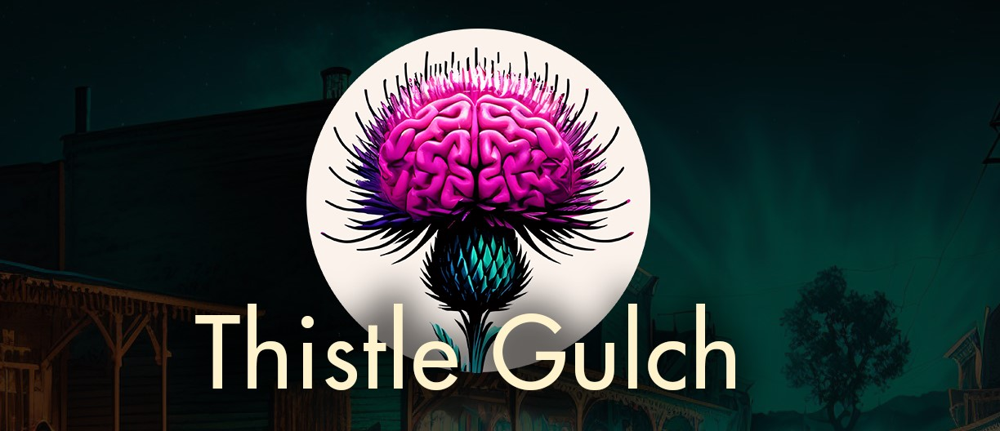
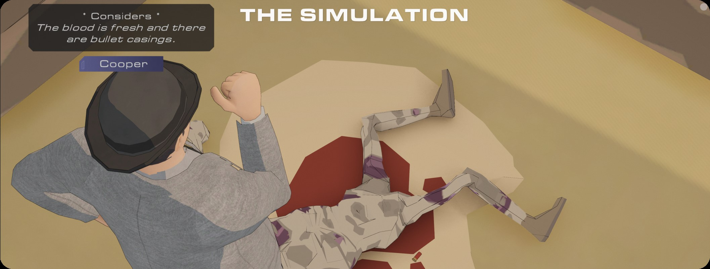

# Thistle Gulch
A Multi-Agent Gym Environment (MAGE) set in the wild west to simulate the actions and conversations of characters in a realistic 3D Western town.



⚠️ NOTE: To use this repo, you need access to the Thistle-Gulch Runtime as well. [Apply for Beta Access on our Website](https://blog.fabledev.com/blog/beta-application-for-thistle-gulch-now-open).

## About
This project consists of two parts that work together: The [Thistle Gulch Simulation](https://fablestudio.itch.io/thistle-gulch) running in
a 3D game engine we call a "Runtime" and a python bridge (referred to simply as the "Bridge" from here 
on out) that acts similar to a client for the Runtime. The Bridge also leverages our
[open-source SAGA python library](https://github.com/fablestudio/fable-saga) to generate actions and conversations. The simulation is rendered in 3D using the Thistle Gulch Runtime app which can be downloaded from itch.io. The Bridge allows many aspects of the simulation to be customized or overridden by manipulating the metadata and/or prompts that are sent to SAGA. While each CAN be run independently - for the proper functioning, you will need both parts. The bridge is available in this repo under a non-commercial use open-source license, while the Runtime is currently available for free under our standard Fable Studio EULA.



## Quick Start

0. Make sure you have python, openAI env var, and poetry installed at least. See Wiki for [Dependencies on Windows, Linux, or macOS](fablestudio/thistle-gulch/wiki/Dependencies)
1. Sign up for the Thistle Gulch beta at https://blog.fabledev.com/blog/beta-application-for-thistle-gulch-now-open and wait to receive your itch.io invite link.
2. Download and install the Thistle Gulch Runtime from itch.io
3. Make sure you have git, python-3.10/11, poetry installed, and your OPENAI key setup (see Installing Dependencies below.)
4. Clone this repo and change the directory to the `python` sub-folder.
5. Run `poetry install` to install dependencies.
6. Start a poetry shell with `poetry shell` to make sure you are using the correct python version and have the correct environment variables set.
7. Run `python run_demos.py --runtime "<PATH_TO_ITCHIO_DIR>/ThistleGulch.exe -agents wyatt_cooper"` . (Runtime flags are described below.)
8. Pick the default SagaServer (option 0) from the available demos. (other available demos listed below)
   ```
   -= Available Demos =-
   0: SagaServer
   1: PrintActionsAndPickFirst
   2: SkipSagaAlwaysDoTheDefaultAction
   3: ReplaceContextWithYamlDump
   4: UseLlama2Model
   Pick a demo to run: 
   ```

The Runtime application will launch a new window and then you should quickly see a message similar to the following from the Bridge:
```
======== Running on http://localhost:8080 ========
(Press CTRL+C to quit)

Runtime [Connected]: l0NKrutjyO4ANhseAAAB
[Simulation Ready] received..
Resuming simulation
```

The icon in the upper-right corner of the Runtime will remain red as long as the bridge is connected and you should quickly see the simulation pause and open a modal with options for wyatt_cooper. You can choose which option you want him to do.
Note that the options are sorted by their score, so the "best" option should be at the top. See the wiki for more details on using the Runtime.

# Making Thistle Gulch your own.
There are lots of ways to customize Thistle Gulch, with more coming in each release. Head over to the [WIKI](wiki) for more in-depth discussion on how to customize Thistle Gulch.
